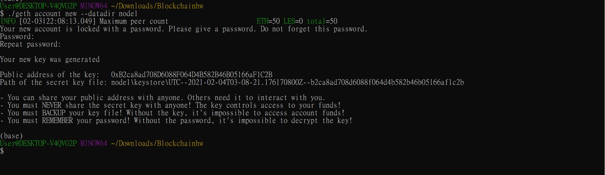
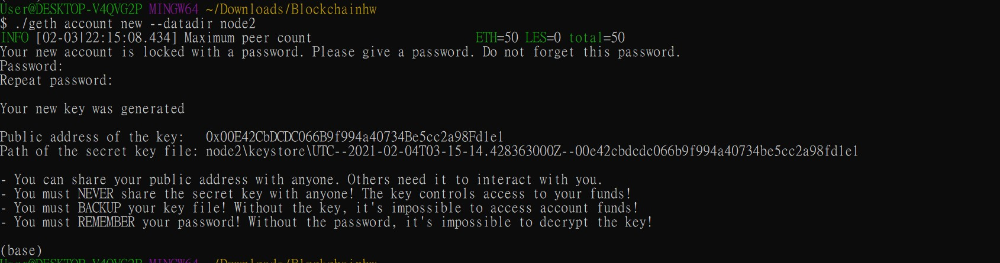
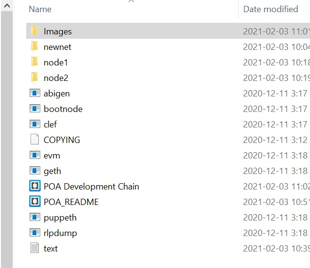
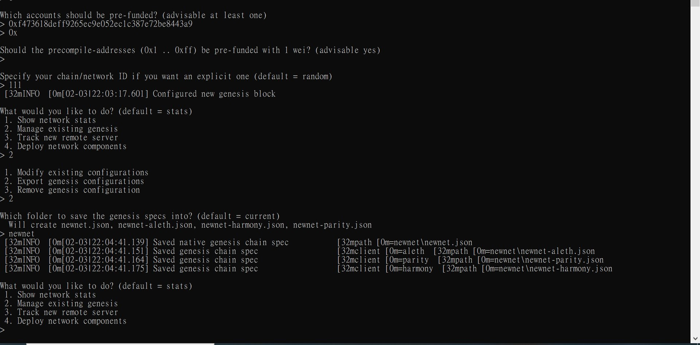
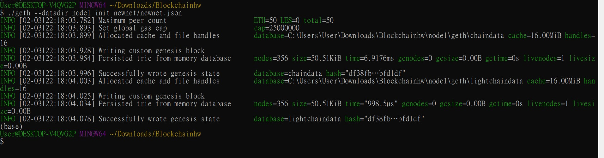
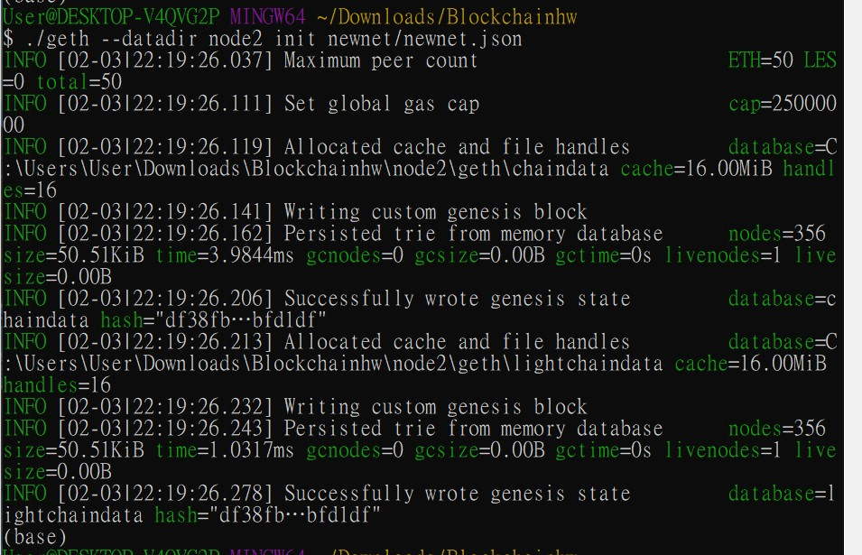
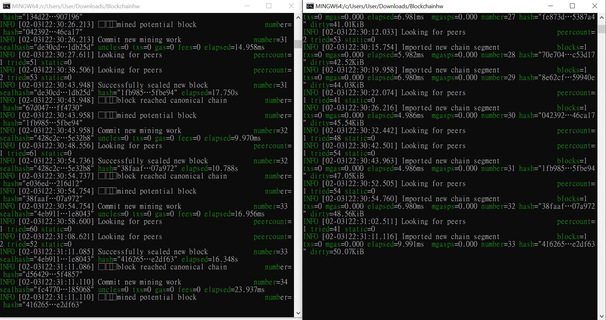
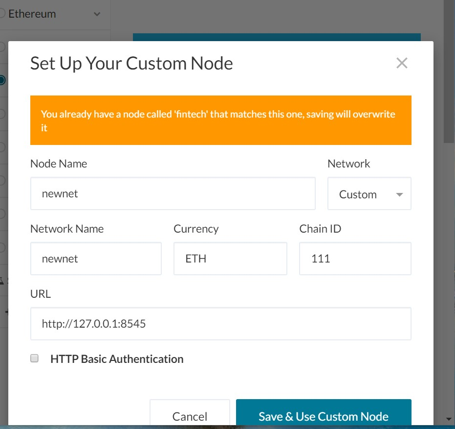
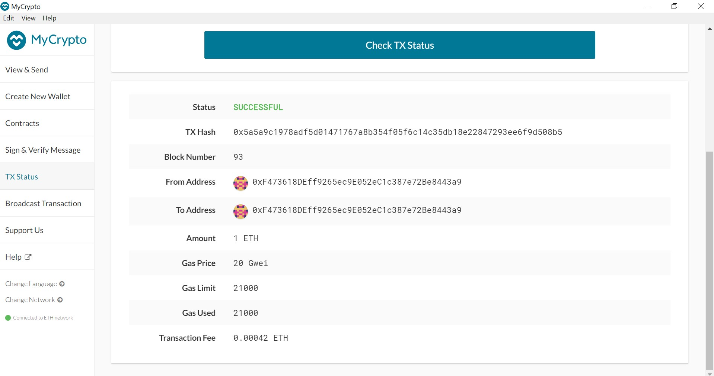
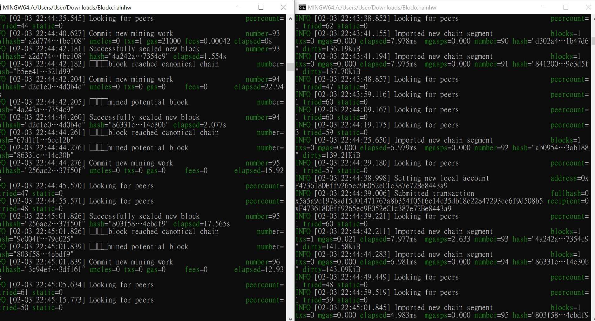

# Unit 18 | Homework Assignment: Building the Blockchain

The blockchain domain is rapidly changing.  Even those in a highly technical role must stay abreast of what is happening in the digital finance landscape as many FinTech companies are using and creating tools and services that are powered by blockchain. As a FinTech professional in these changing times, it's important to not only be aware of the advancements happening within the FinTech blockchain space, but to also understand the process for developing your very own blockchain.

This homework will be a two-part series in which you will first create a case study on a Canadian FinTech blockchain company. Then, you wil develop your very own blockchain.

## Proof of Authority Development Chain

Your mission, should you choose to accept it, will be to set up a testnet blockchain for your organization.

To do this, you will create and submit four deliverables:

* Set up your custom testnet blockchain.

* Send a test transaction.

* Create a repository.

* Write instructions on how to use the chain for the rest of your team.

### Enviromnet Setup

* Download the geth tools by visiting the Go Ethereum Tools download page at https://geth.ethereum.org/downloads/

### Generating Custom Genesis Block and Nodes 

1. Using `geth` command to create 2 nodes for the network: 

    * `./geth --datadir node1 account new`
    * `./geth --datadir node2 account new`
    
    
    

2. Create Genesis Block: 
    * Create a new project directory for your new network. Call it whatever you want!

    * Create a "Screenshots" folder inside of the project directory.
    

    * Run `puppeth`, name your network, and select the option to configure a new genesis block.

    * Choose the `Clique (Proof of Authority)` consensus algorithm.

    * Paste both account addresses from the first step one at a time into the list of accounts to seal.

    * Paste them again in the list of accounts to pre-fund. There are no block rewards in PoA, so you'll need to pre-fund.
    * You can choose `no` for pre-funding the pre-compiled accounts (0x1 .. 0xff) with wei. This keeps the genesis cleaner.

    * Complete the rest of the prompts, and when you are back at the main menu, choose the "Manage existing genesis" option.

    * Export genesis configurations. This will fail to create two of the files, but you only need `newnet.json`.
    

3. Network Configuration
    * Export genesis configurations. This will fail to create two of the files, but you only need `networkname.json`.

    * You can delete the `networkname-harmony.json` file.

    * Screenshot the `puppeth` configuration once complete and save it to the Screenshots folder.

    * Initialize each node with the new `networkname.json` with `geth`.
    
    
    

    * Run the first node, unlock the account, enable mining, and the RPC flag. Only one node needs RPC enabled.

    * Set a different peer port for the second node and use the first node's `enode` address as the `bootnode` flag.

    * Be sure to unlock the account and enable mining on the second node!

    * You should now see both nodes producing new blocks, congratulations!
    

    * Blocktime: 15 mins, which is the default block time.
    * Chain ID: 111
    * node 1: 111; node 2: 111
    * Node ports: node 1- 30303; node 2- 30304
    * Network ports: 8545
    * Consensus Algorithm: Clique (Proof of Authority)

#### Send a test transaction

* Use the MyCrypto GUI wallet to connect to the node with the exposed RPC port.

* You will need to use a custom network, and include the chain ID, and use ETH as the currency.

* Import the keystore file from the `node1/keystore` directory into MyCrypto. This will import the private key.

* Send a transaction from the `node1` account to the `node2` account.

 
* Copy the transaction hash and paste it into the "TX Status" section of the app, or click "TX Status" in the popup.

* Screenshot the transaction metadata (status, tx hash, block number, etc) and save it to your Screenshots folder.

* Celebrate, you just created a blockchain and sent a transaction!

