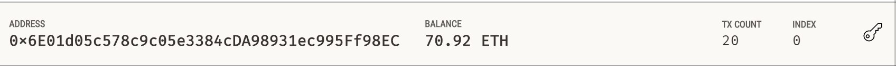

# Unit 20| Homework Assignment: "Looks like we've made our first contract!"

## Background

Your new startup has created its own Ethereum-compatible blockchain to help connect financial institutions, and the team wants to build smart contracts to automate some company finances to make everyone's lives easier, increase transparency, and to make accounting and auditing practically automatic.

Fortunately, you've been learning how to program smart contracts with Solidity! What you will be doing this assignment is creating 3 `ProfitSplitter` contracts. These contracts will do several things:

* Pay your associate-level employees quickly and easily.

* Distribute profits to different tiers of employees.

* Distribute company shares for employees in a "deferred equity incentive plan" automatically.

## Files

* [`AssociateProfitSplitter.sol`](Starter-Code/AssociateProfitSplitter.sol) — Level 1 starter code.

* [`TieredProfitSplitter.sol`](Starter-Code/TieredProfitSplitter.sol) — Level 2 starter code.

* [`DeferredEquityPlan.sol`](Starter-Code/DeferredEquityPlan.sol) — Level 3 starter code.

## Instructions

## Instructions

	This assignment has three levels of difficulty, with each contract increasing in complexity and capability. Although it is highly recommended you complete all three contracts, you are only required to solve one of the three contracts. Recommended to start with Level 1, then move forward as you complete the challenges. You can build all three with the skills you already have!

* **Level One** is an `AssociateProfitSplitter` contract. This will accept ether into the contract, and divide it evenly among associate-level employees. This will allow the human resources department to pay employees quickly and efficiently.

* **Level Two** is a `TieredProfitSplitter` that will distribute different percentages of incoming ether to employees at different tiers/levels. For example, the CEO gets paid 60%, CTO 25%, and Bob gets 15%.

* **Level Three** is a `DeferredEquityPlan` that models traditional company stock plans. This contract will automatically manage 1000 shares, with an annual distribution of 250 shares over four years for a single employee.

### Starting your project

Navigate to the [Remix IDE](https://remix.ethereum.org) and create a new contract called `AssociateProfitSplitter.sol` using the starter code for Level One above.

While developing and testing your contract, use the [Ganache](https://www.trufflesuite.com/ganache) development chain, and point MetaMask to `localhost:8545`, or replace the port with what you have set in your workspace.

### Level One: The `AssociateProfitSplitter` Contract

At the top of your contract, you will need to define the following `public` variables and constructor
[Payables and constructor ](Images/payable.jpg)

Next, create the following functions:
[Functions](Images/fn.jpg)
* `balance` — This function should be set to `public view returns(uint)`, and must return the contract's current balance. Since we should always be sending ether to the beneficiaries, this function should always return `0`. If it does not, the `deposit` function is not handling the remainders properly and should be fixed. This will serve as a test function of sorts.

* `deposit` — This function should be set to `public payable` check, ensuring that only the owner can call the function.

* Create a fallback function using `function() external payable`, and call the `deposit` function from within it. This will ensure that the logic in `deposit` executes if ether is sent directly to the contract. This is important to prevent ether from being locked in the contract, since we don't have a `withdraw` function in this use case.

#### Test the contract

In the `Deploy` tab in Remix, deploy the contract to your local Ganache chain by connecting to `Injected Web3` and ensuring MetaMask is pointed to `localhost:8545`.

You will need to fill in the constructor parameters with your designated `employee` addresses.

Test the `deposit` function by sending various values. Keep an eye on the `employee` balances as you send different amounts of ether to the contract and ensure the logic is executing properly.

